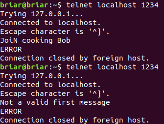
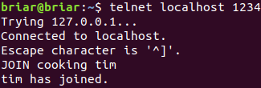
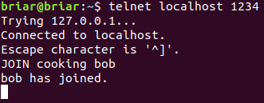
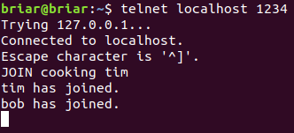
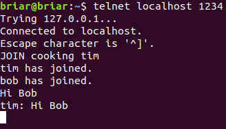
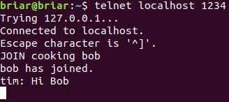
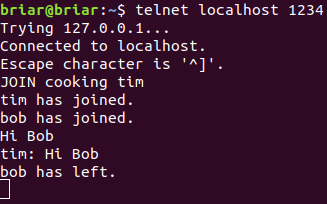

---
title: Group Chat Server with Linux Epoll 
layout: template
filename: groupchatserver
--- 

# Detecting a cell phone with OpenCV 
View the code on GitHub [here](https://github.com/briarsmith/group-chat-server)

### Goal
To create a facebook-like group chat server that can support up to 1000 connnects. People can connect to a particular group to chat with eachother using the command <code>JOIN group name</code>. A group will be created if it doesn't exist already. A broadcast will be sent to all of the existing people in the group when a user joins or leaves. The connection to the server will be closed if an invalid JOIN command is sent (improper formatting, etc).

Here's an example of some invalid join commands. The first one uses <code>JoiN</code> rather than <code>JOIN</code>. The second one doesn't use <code>JOIN</code> at all, but instead sends <code>Not a valid first message</code> to the server.  

 
Invalid Join Commands  

And here is an example of a person joining the <code>cooking</code> group with the name <code>tim</code>.

 
Tim Joining the Cooking Group  

Extending this example, another separate connection is made to <code>cooking</code>, this persons name is <code>bob</code>.

 
Bob Joining the Server  

And from Tim's perspective of the group chat <code>cooking</code>, it says "Bob has joined".

 
Tims Perspective of Bob Joining the Cooking Group  

Now when Tim or Bob speaks, they both will see the messages.

 
Tim Broadcasts Hi Bob to the Cooking Group  

Bob's perspective of Tim saying "Hi Bob"

 
Bobs Perspective of Tims Message  

To wrap this example up, Bob leaves the chat (in this case, the terminal was force closed).

 
Tims Perspective of Bob Leaving the Server  

### Design Options
1. Syncronous <code>read</code> and <code>write</code> functions are an option, however it was clear that they were not going to be able to handle a large amount of file descriptors because each FD needed to be polled individually for changes. 
2. Using async IO would notify a handle of events of only FD's that had an event fire on them. Specifically, the <code>epoll</code> function could be used for this, which interfaces directly with the Linux kernel. Using the <code>#include aio</code> library would allow the multiple async queuing of writes when necessary too, such as for the broadcasts. 
3. To use a thread pool where each thread is responsible for an equally distributed range of file descriptors depending on the number of connections. 
 
### Design Decision, Results Summary
Although option 1 is easier to implement, it supports a small number of connections due to its non-async nature. Option 3 is more complicated to implement, as dealing with threads always is, and there's the overhead of thread switching. Even with a thread pool, with a large number of connections it's likely to still bottleneck using the sync function calls. Therefore the choice was fairly simple, to use epoll and async io, option 2, as it is a natural, seemingly efficient and relatively easy solution to implement (though more complicated than option 1). 

### Common Problems and Improvements
Overall the system works as desired and supports a large number of connections. Other than the minor bug fixes and code clarity/restructuring, it would be helpful to find a non standard library that would simplify a lot of the socket programming. This was done with standard libraries mostly for the learning experience, but I would be curious to know how it compares to 3rd party library implementations for speed and efficiency. 
