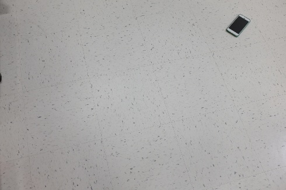
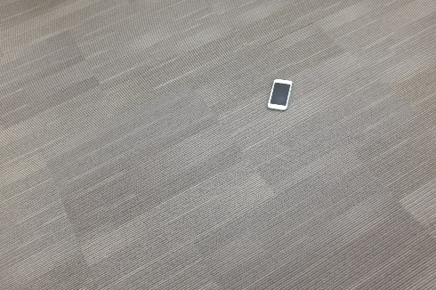
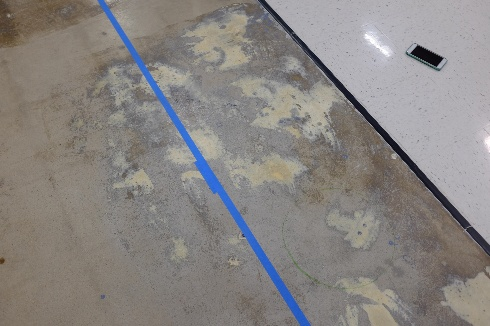
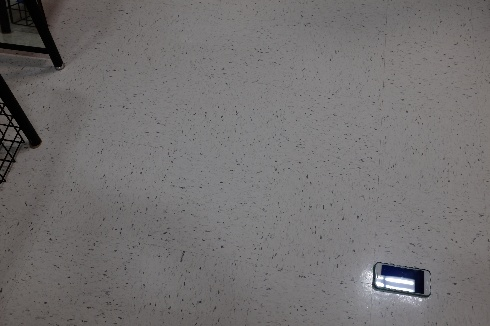
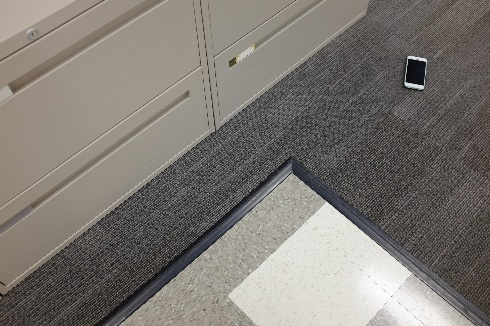
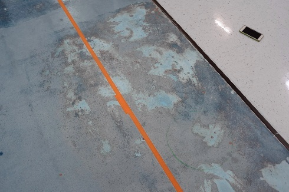
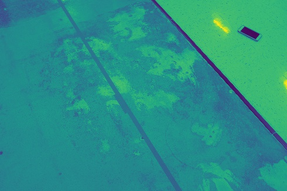
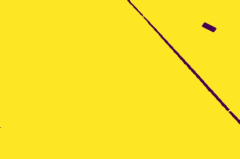

---
title: Phone Detector with OpenCV 
layout: template
filename: phonedetector 
--- 

# Detecting a cell phone with OpenCV 
View the code on GitHub [here](https://github.com/briarsmith/phone-detector-opencv)

### Goal
The goal is given a cell phone on a floor, find the center of the phone in the image with a 0.05 (normalized) radius accuracy. Some assumptions:
1. The phone will always be the same 
2. The phone can be on various types of floors (see the given dataset)

Here are some example images from the dataset (the entire dataset can be found in the github code):

 
White Background  
 
Grey Background  
 
Grey & White Background  
 
Phone Glare  
 
Black Background  

### Design Options
Given the nature of the images, one thing that stood out is that the phone is quite salient. It often is the darkest object in the image, and also often has the smallest area. This led to a few different possible design decisions:
1. Use classical image processing to threshold the image (black or white) to eliminate a lot of the possible search space. Then check all of the contours remaining in the image for geometric properties pertaining to the phone.
1. The problem is well suited for object localization using machine learning. It's a relatively constrained problem and the phone has quite distinguishing features to the human eye. The dataset is only 130 images, which could pose challenging for commonly used techniques for computer vision such as transfer learning. Data augmentation will likely need to be leveraged to help detect the phones features. 

### Design Decision, Results Summary
I figured that if transfer learning was to work it was likely to detect the phones features better than I could with classical image processing and searching for features I defined myself. Transfer learning, using initial weights from common computer vision pre-trained networks such as ImageNet could be used as a starting point to train for this new localization problem. Given that there were only 130 test images, and that data collection is tiresome, the data would likely need to be augmented. I attempted to use VGG16 initially with transfer learning and data augmentation, but was not obtaining a good accuracy. Therefore I ended up trying option 1, and had much more success. 

Here are examples of the final output, which had a detection accuracy of 85% and a high percision (0.01-0.02 radius)

### Process
First, I converted the image to black/white in order to reduce search space:

 
Grey & White Background  
 
RGB to Black and White  

Then, I thesholded the images at a certain black depth (represented as yellow/purple below).

 
Black Thresholded  

In this example, as is common in many of the examples, the thresholding picks up multiple different objects. Therefore, geometric properties of the phone needed to be used to differentiate the floor divider and the phone:

I used average geometric properties of the phone, including:
1. average relative area
Depending on where the phone was in the image, it varied quite a bit in area from 150px - 850px. Obviously there are many other contours that will likely meet this criteria. 
2. average number of vertices
On average, a phone has 4 vertices (like a rectangle). Sometimes it can have more though, if a shadow is picked up from the phone it could have 6, or if glare is on the phone (white light) it can create an "L" shape as the phone, as seen below
3. average and relative arc length
If a contour meets the area requirement and vertices requirement (3-5 usually), the arc length is then checked. If the arc length is very long, then there are likely many "zig zags" in the contour, as a rectangle tends to be quite efficient in terms of arc length

### Common Problems and Improvements
Overall the algorithm was quite successful but it could be improved further. Checking the amount of 90 degree angles in the contours would help improve accuracy, especially in situations where there is glare. Sometimes the thresholding failed if the background was gray, which is a major source of error in this method. Perhaps another machine learning approach and obtaining more data would help improve the accuracy to better distingush the features of a gray background and the phone. Though it can be done with image processing, it's much easier for a machine learning algorithm to articulate the features that distingush it then I am, and it would be able to cover many more cases provided it has the data.  

