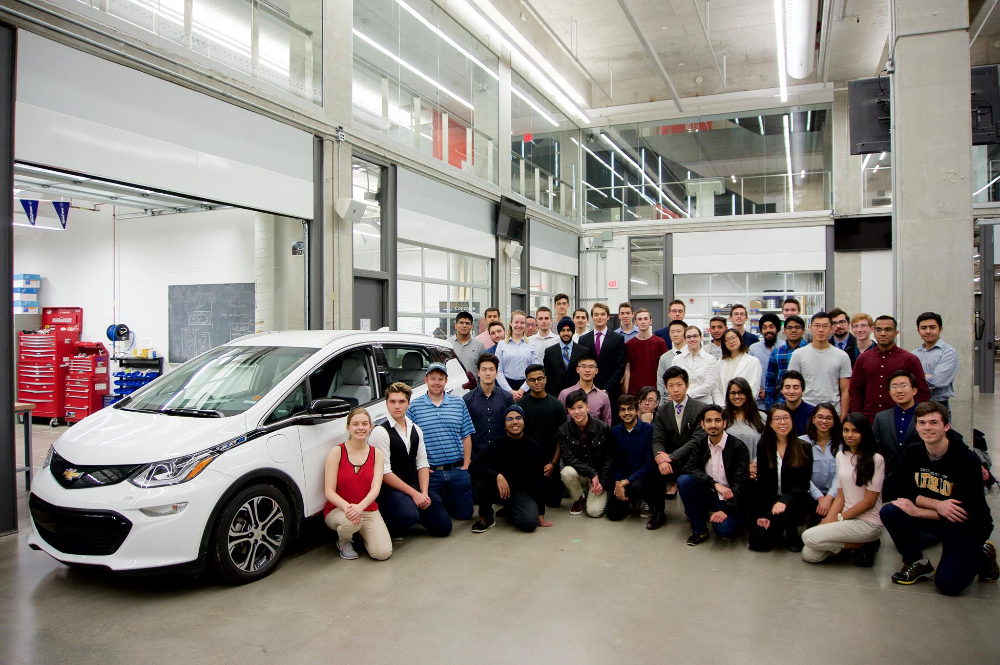
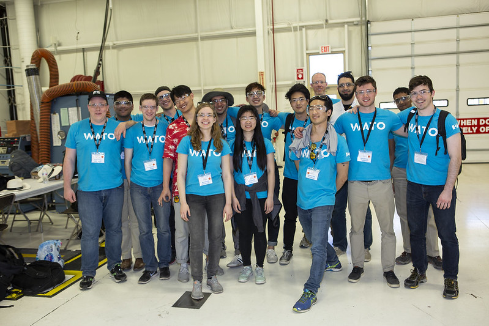
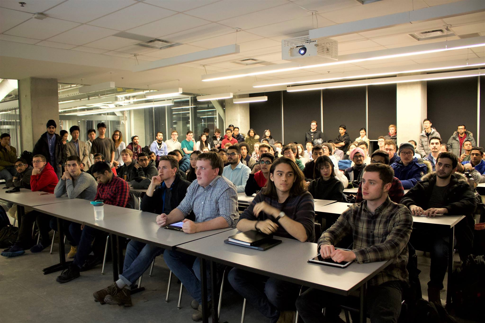
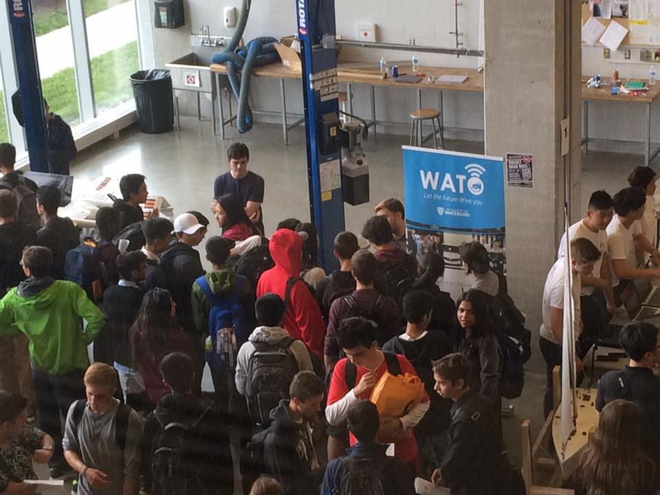
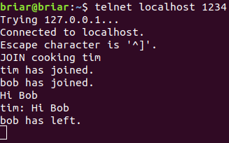

---
title: Autonomous Vehicle Student Design Team 
layout: template
filename: watonomous 
--- 

# UWaterloo's AV Student Design Team 
View the teams website [here](https://watonomous.ca)

### Background
I founded the University of Waterloo's autonomous vehicle student design team, Watonomous, in 2017. I also led the team to achieve multiple top awards at the 1st annual competition as the Team Captain. 

In order to enter into the competition, called the SAE AutoDrive Challenge, schools had to submit proposals to SAE & GM, and based on the demonstrated available resources and research support in AVs, along with a carefully articulated demonstration of abilities as a school in general, the proposal I submitted was successful, and I coined the name Watonomous.

Here's a photo of the very original team, right when we got the vehicle and our work bay area (the open garage in the background) (I am at the bottom right):

 
First Team Photo with the Bolt  

### Goal

The goal is to work towards developing a level 4 autonomous vehicle (a donated Chevy Bolt EV). Several competition sponsors such as Velodyne, Intel, and GM provided the necessary resources to accomplish this. In the first year of the competition there were several challenges the team had to overcome, and many associated design reports. For example, the top technical challenges in the first year included: 
1. The Stop Sign Challenge
The vehicle had to perform a smooth stop close to a stop sign line. This required detecting the stop sign and planning the appropriate path. 

2. Tight Radius Challenge
The vehicle had to navigate a mile or so of a tight lane with various radius curves

3. Obstacle Avoidance Challenge
The vehicle was placed in a 3-lane highway with static objects such as cars, bicyclists, and pedestrians, and had to switch lanes in order to avoid hitting them.

Here's a video that gives a better visual representation of what the challenge was like in the first year. You can hear my interview starting at 1:00! 

This is the portion of our team that was able to come to the competition (only 15 were sponsored to come). It consisted of the team leads (perception, embedded, electrical, etc.), our primary faculty advisor, GM team advisor, as well as myself. (I'm on the right again)

 
Yuma, AZ Team  

### Responsibilities 

In addition to the technical challenges and associated design reports, there were many other obstacles the team had to overcome. Most notably:
1. Organizational challenges: the structure of the team, such as a way to have certain people responsible for certain features, and to allow isolated work. Also, establishing communication protocols within the team and for myself with professors and industry stakeholders/advisors. Also establishing work-flows. Creating a fair and targeted hiring process, including marketing campaign, for the team while still trying to take on as many students as possible. Creating weekly team meetings/slides to ensure the team has a wholistic view of where the team was headed. 
 This photo taken at our first information session may help visualize the amount of interest in the team. 

 
Beginning of Term Info Session  

And here's me (under the blue vehicle lift) on student teams day.

 
Beginning of Term Info Session  

2. Funding challenges: the sponsored materials were not enough to design a reliable AV. The electrical system, for example, was not sponsored. I pitched to obtain the team approximately $40,000 in funding through school endowment funds. I also assisted the finance team greatly in reaching out to sponsors.

Overall, these organizational and funding challenges took a significant amount of my time, as students tend to still be working on their communication skills, and it simply is a challenging problem, even in industry, especially with larger teams (the team was roughly 150 students, close to 200 at one point). 

Some technical projects I worked on:

 
Tims Perspective of Bob Leaving the Server  

### My Role

### Design Options
 
### Design Decision, Results Summary
### Common Problems and Improvements
